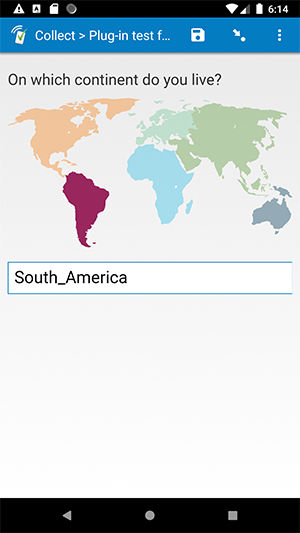

# Clickable SVG

## Description

This plug-in allows you to click on a part of an image and record which part was clicked. Clicking on a named region (either a path or a group of paths with an ID) in an .svg image will select that region, and fill in the text field with the ID of the region. To help indicate which region is currently selected, all regions will start out at 40% opacity. When selected, a region will return to 100% opacity.

## Default SurveyCTO feature support

| Feature / Property | Support |
| --- | --- |
| Supported field type(s) | `text`|
| Default values | Yes |
| Constraint message | Uses default behavior |
| Required message | Uses default behavior |
| Read only | Yes *(shows the current value, if present)* |
| media:image | Yes (required) |
| media:audio | Yes |
| media:video | Yes |
| `numbers` appearance | Yes |
| `numbers-decimal` appearance | Yes |
| `numbers-phone` appearance | Yes |

## How to use

1. Create a text field.
1. Attach an .svg image file to that text field (using the media:image field property).
1. Attach this plug-in to the text field.
1. When you fill out the form and click on a region in the image, the ID value of that region will be entered into the text field and stored as the response data.

**Notes about your .svg file**  
Each selectable region must have a unique ID attribute. If you create your .svg file using Adobe Illustrator or Vectr, this should be done automatically. If you create your .svg file using Inkscape, or you are using an .svg file that you got from somewhere else, you may need to edit it yourself to make sure that only the selectable regions have ID attributes. Check out the [test-form](extras/test-form) and the two associated .svg files to see examples. See below for links to some other resources which might help you.

## More resources

* **Test form**  
[extras/test-form](extras/test-form)
* **Free tools for creating .svg files**  
[https://vectr.com/](https://vectr.com/)  
[https://inkscape.org/](https://inkscape.org/)  
[https://www.sketch.com/](https://www.sketch.com/)  
* **How to Optimize and Export SVGs in Adobe Illustrator**  
[https://www.sitepoint.com/crash-course-optimizing-and-exporting-svgs-in-adobe-illustrator/](https://www.sitepoint.com/crash-course-optimizing-and-exporting-svgs-in-adobe-illustrator/)
* **Free online SVG creator and editor**  
[https://vectr.com/](https://vectr.com/)
* **Developer documentation for field plug-ins**  
More instructions for developing and using field plug-ins. [https://github.com/surveycto/Field-plug-in-resources](https://github.com/surveycto/Field-plug-in-resources)